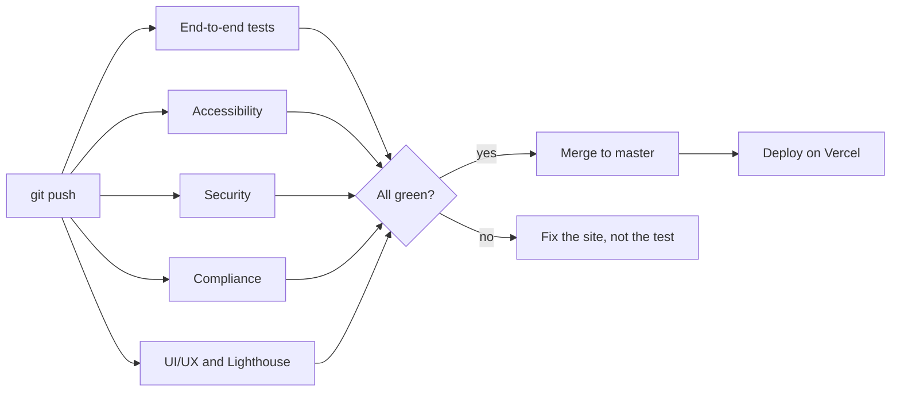

<div align="center">

# Fabio Dorneles · Portfolio

**A trilingual portfolio and technical blog, built as a quality exercise: every change goes through automated tests for accessibility, security, privacy and performance before it ships.**

[**fabiodorneles.com.br**](https://fabiodorneles.com.br) · [Quality page](https://fabiodorneles.com.br/en/quality) · [Blog](https://fabiodorneles.com.br/en/blog)

🇬🇧 English · [🇧🇷 Português](README.pt-BR.md)

[](https://github.com/fabiodrneles/portfolio-react/actions/workflows/ci.yml)
[](https://github.com/fabiodrneles/portfolio-react/actions/workflows/accessibility.yml)
[](https://github.com/fabiodrneles/portfolio-react/actions/workflows/security.yml)
[](https://github.com/fabiodrneles/portfolio-react/actions/workflows/compliance.yml)
[](https://github.com/fabiodrneles/portfolio-react/actions/workflows/uiux.yml)


</div>

## What is this?

This is the source code of my personal site. It works as a portfolio, but also as a working example of how I approach software: small specs, end-to-end tests that are never weakened to make a build pass, and pipelines that check accessibility, security, privacy and performance on every push.

I am open to QA and software development opportunities. You can reach me through the [site](https://fabiodorneles.com.br/en#contact), [LinkedIn](https://www.linkedin.com/in/fabiodrneles/) or [GitHub](https://github.com/fabiodrneles).

## Highlights

- **Three languages, one codebase.** Portuguese (default, no prefix), English (`/en`) and French (`/fr`), with its own URL, `hreflang` tags and sitemap entries per language. The language is picked from the browser on the first visit and remembered after a manual choice.
- **Technical blog.** Statically generated articles with per-language SEO titles and descriptions, JSON-LD (`BlogPosting` and `BreadcrumbList`), generated Open Graph images and an RSS 2.0 feed per language.
- **Every article is published in all three languages.** A reader opening an article in French reads it in French.
- **Accessibility first.** WCAG 2.2 A and AA checked by axe-core and Pa11y, across pages, languages and screen sizes.
- **Privacy by design.** No cookies, trackers or analytics before a visitor acts, and a privacy policy written for the Brazilian LGPD, tested by the pipeline.
- **Hardened by default.** CSP, HSTS and other HTTP security headers are asserted by tests; secrets scanning, static analysis and dependency review run on every push.
- **Fast.** Self-hosted fonts, static generation and Lighthouse CI budgets for mobile and desktop.
- **A CV in the reader's language.** The download button serves the Portuguese or English PDF depending on the page language.

<table>
  <tr>
    <td width="50%"></td>
    <td width="50%"></td>
  </tr>
  <tr>
    <td align="center"><sub>Technical article with code blocks</sub></td>
    <td align="center"><sub>The <a href="https://fabiodorneles.com.br/en/quality">Quality page</a>, generated from this repository</sub></td>
  </tr>
</table>

<div align="center">

<br>
<sub>Mobile layout, tested at 390 px</sub>
</div>

## How quality is enforced



| Pipeline | What it checks |
| --- | --- |
| **End-to-end tests** (`ci.yml`) | The whole Cypress suite against the production build of the commit |
| **Accessibility** (`accessibility.yml`) | axe-core (WCAG 2.2 A and AA) on pages × languages × screen sizes, plus Pa11y (HTML_CodeSniffer, WCAG2AA) |
| **Security** (`security.yml`) | `npm audit`, dependency review on pull requests, CodeQL, Gitleaks, and tests for HTTP headers, cookies and attack surface |
| **Compliance** (`compliance.yml`) | LGPD and privacy tests, and a check of open source licenses against an allowlist |
| **UI/UX** (`uiux.yml`) | Interface, forms and content tests, plus Lighthouse CI on mobile and desktop |

Lighthouse budgets enforced in CI: accessibility, best practices and SEO ≥ 0.95; performance ≥ 0.8 on mobile and ≥ 0.9 on desktop; LCP ≤ 4 s on mobile and ≤ 2.5 s on desktop; CLS ≤ 0.1.

All pipelines run on every push and again every Monday, to catch new vulnerabilities in old dependencies.

Two rules shape how the project evolves:

1. **Tests are the source of truth.** When code and a test disagree, the code is wrong. Existing tests are never edited, weakened or bypassed to get a build green. New tests are always welcome.
2. **Spec-driven development.** Every area has a short spec in [`specs/`](specs/README.md) with acceptance criteria tied to the test that proves each one. A change starts with the spec and ends with the spec updated.

> Automated checks are not a substitute for manual testing with screen readers or measurements with real visitors. See [`docs/compliance`](docs/compliance/README.md) for what the pipelines prove and what they do not.

## Tech stack

| Area | Choice |
| --- | --- |
| Framework | [Next.js 16](https://nextjs.org) (App Router, static generation) and React 19 |
| Language | JavaScript (ES modules) |
| Content | Articles in `src/posts/posts.js`, with Markdown or HTML bodies |
| Editor | Quill 2 (`react-quill-new`) in the `/admin` draft page |
| Contact form | [EmailJS](https://www.emailjs.com) |
| Testing | Cypress, cypress-axe, axe-core, Pa11y, Lighthouse CI |
| Security | CodeQL, Gitleaks, dependency review, Dependabot |
| Hosting | Vercel |

## Project structure

```text
src/
├── app/[lang]/        routes per language: home, blog, quality, privacy, admin, RSS feed
├── components/        UI by area (header, home, blog, contact, footer, admin...)
├── i18n/              locale config, metadata helpers and dictionaries (pt, en, fr)
├── data/portfolio.js  links, stack, projects, experience and education
├── posts/             blog articles and per-language selection
├── lib/               feed, SEO, Open Graph images, site constants
└── proxy.js           picks the language of each visit (cookie, then Accept-Language)
cypress/e2e/           end-to-end specs
specs/                 one short spec per area, with acceptance criteria
docs/                  compliance map and screenshots
.github/workflows/     the five pipelines
```

## Getting started

Requirements: Node.js 22 (the version used in CI) and npm.

```bash
git clone https://github.com/fabiodrneles/portfolio-react.git
cd portfolio-react
npm ci
npm run dev        # http://localhost:3000
```

| Command | What it does |
| --- | --- |
| `npm run dev` | Development server |
| `npm run build` | Production build |
| `npm run start` | Serves the production build |
| `npm run lint` | ESLint |
| `npm run cypress:open` | Cypress in interactive mode |
| `npm run cypress:run` | Cypress in headless mode |

### Running the tests

The Cypress specs target the published site unless told otherwise. To test your local production build, as CI does:

```bash
npm run build
npm run start &                                   # http://localhost:3000
CYPRESS_BASE_URL=http://localhost:3000 npm run cypress:run
```

### Environment variables

The contact form uses EmailJS. Without these variables the site still builds, but sending a message fails.

```bash
NEXT_PUBLIC_EMAILJS_SERVICE_ID=
NEXT_PUBLIC_EMAILJS_TEMPLATE_ID=
NEXT_PUBLIC_EMAILJS_PUBLIC_KEY=
```

The legacy `REACT_APP_EMAILJS_*` names are still accepted (see `next.config.mjs`). EmailJS public keys are public by design. Protection is configured in the EmailJS dashboard (allowed domains and sending limits).

## Writing a new article

1. Open `/admin` locally and write the article in the three language tabs (Portuguese, English and French). The page counts SEO characters, warns about missing translations and has a guide for inserting code blocks.
2. Copy the generated code and paste it as the first item of the `posts` array in `src/posts/posts.js`.
3. Run `npm run lint` and `npm run build`, then open a pull request. The pipelines validate titles, descriptions, translations, accessibility and the sitemap and feed entries.

An article without English and French versions is not published to production.

## Documentation

- [`specs/`](specs/README.md): the specs, one per area, with acceptance criteria and the tests that prove them
- [`docs/compliance/`](docs/compliance/README.md): maps each law and standard (LGPD, WCAG, security headers) to the automated test that checks it
- [`SECURITY.md`](SECURITY.md): how to report a vulnerability privately

## License

© Fabio Dorneles. All rights reserved. The code is public so that you can read it and see how the site is built; please contact me before reusing it or the content.
