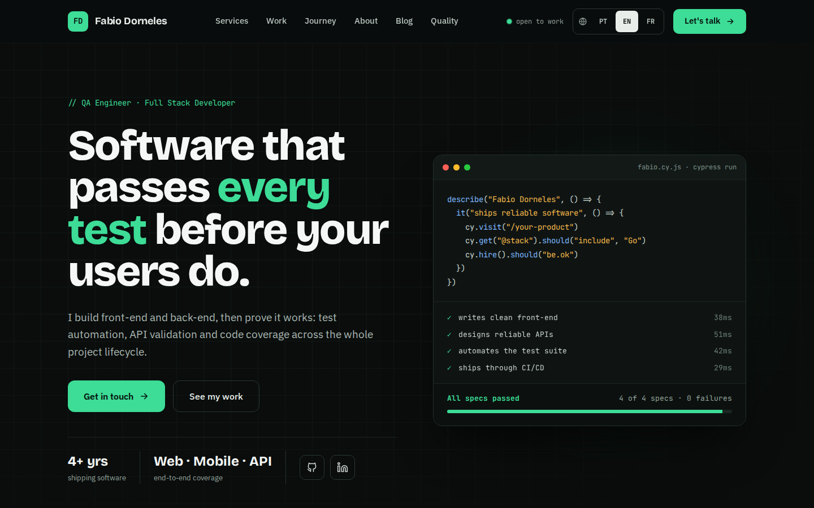
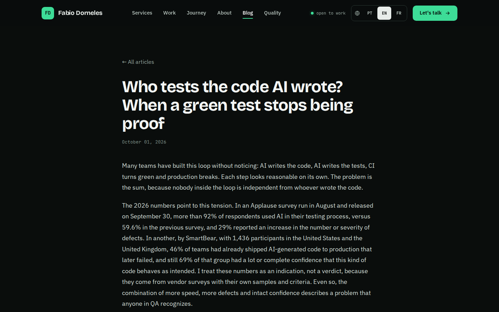
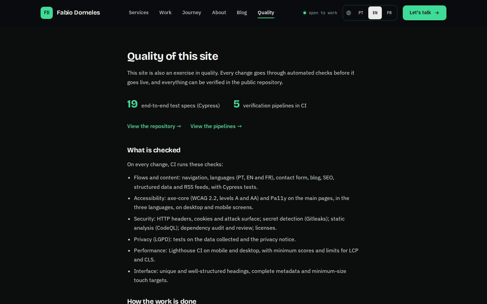
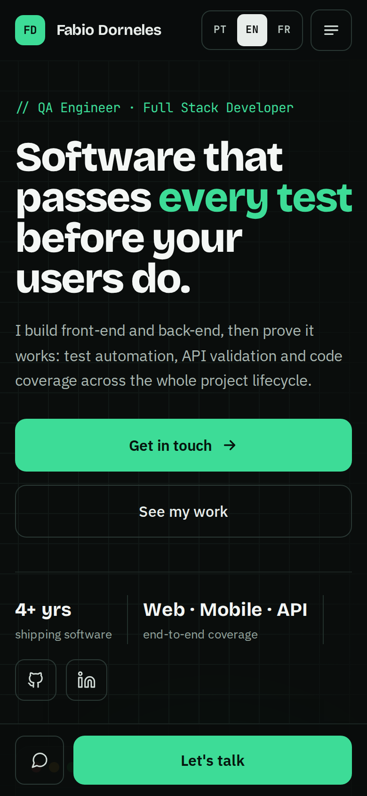
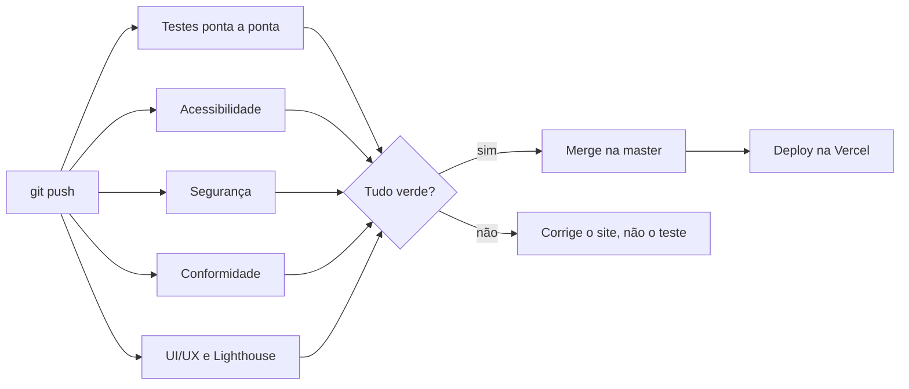

<div align="center">

# Fabio Dorneles · Portfólio

**Um portfólio e blog técnico em três idiomas, feito como exercício de qualidade: toda mudança passa por testes automáticos de acessibilidade, segurança, privacidade e desempenho antes de ir ao ar.**

[**fabiodorneles.com.br**](https://fabiodorneles.com.br) · [Página de qualidade](https://fabiodorneles.com.br/quality) · [Blog](https://fabiodorneles.com.br/blog)

[🇬🇧 English](README.md) · 🇧🇷 Português

[](https://github.com/fabiodrneles/portfolio-react/actions/workflows/ci.yml)
[](https://github.com/fabiodrneles/portfolio-react/actions/workflows/accessibility.yml)
[](https://github.com/fabiodrneles/portfolio-react/actions/workflows/security.yml)
[](https://github.com/fabiodrneles/portfolio-react/actions/workflows/compliance.yml)
[](https://github.com/fabiodrneles/portfolio-react/actions/workflows/uiux.yml)




</div>

## O que é isto?

Este é o código-fonte do meu site pessoal. Ele funciona como portfólio, mas também como um exemplo prático de como eu trabalho: specs curtas, testes ponta a ponta que nunca são enfraquecidos para fazer um build passar e pipelines que verificam acessibilidade, segurança, privacidade e desempenho a cada push.

Estou aberto a oportunidades de QA e de desenvolvimento. Você me encontra pelo [site](https://fabiodorneles.com.br#contact), pelo [LinkedIn](https://www.linkedin.com/in/fabiodrneles/) ou pelo [GitHub](https://github.com/fabiodrneles).

## Destaques

- **Três idiomas, um só código.** Português (padrão, sem prefixo), inglês (`/en`) e francês (`/fr`), com URL própria, marcações `hreflang` e entradas no sitemap para cada idioma. O idioma é escolhido pelo navegador na primeira visita e lembrado depois de uma escolha manual.
- **Blog técnico.** Artigos gerados estaticamente, com título e descrição de SEO por idioma, JSON-LD (`BlogPosting` e `BreadcrumbList`), imagens Open Graph geradas e um feed RSS 2.0 por idioma.
- **Todo artigo sai nos três idiomas.** Quem abre um artigo em francês lê em francês.
- **Acessibilidade em primeiro lugar.** WCAG 2.2 A e AA verificadas pelo axe-core e pelo Pa11y, em várias páginas, idiomas e tamanhos de tela.
- **Privacidade desde o projeto.** Sem cookies, rastreadores nem análise antes de uma ação do visitante, e uma política de privacidade escrita para a LGPD, testada pelo pipeline.
- **Endurecido por padrão.** CSP, HSTS e outros cabeçalhos HTTP de segurança são verificados por testes; detecção de segredos, análise estática e revisão de dependências rodam a cada push.
- **Rápido.** Fontes servidas pelo próprio site, geração estática e limites do Lighthouse CI para celular e desktop.
- **Currículo no idioma de quem lê.** O botão de download entrega o PDF em português ou em inglês, conforme o idioma da página.

<table>
  <tr>
    <td width="50%"></td>
    <td width="50%"></td>
  </tr>
  <tr>
    <td align="center"><sub>Artigo técnico com blocos de código</sub></td>
    <td align="center"><sub>A <a href="https://fabiodorneles.com.br/quality">página de qualidade</a>, gerada a partir deste repositório</sub></td>
  </tr>
</table>

<div align="center">

<br>
<sub>Layout no celular, testado em 390 px</sub>
</div>

## Como a qualidade é garantida



| Pipeline | O que verifica |
| --- | --- |
| **End-to-end tests** (`ci.yml`) | Toda a suíte do Cypress contra o build de produção do commit |
| **Acessibilidade** (`accessibility.yml`) | axe-core (WCAG 2.2 A e AA) em páginas × idiomas × tamanhos de tela, mais o Pa11y (HTML_CodeSniffer, WCAG2AA) |
| **Segurança** (`security.yml`) | `npm audit`, revisão de dependências nos pull requests, CodeQL, Gitleaks e testes de cabeçalhos HTTP, cookies e superfície de ataque |
| **Conformidade** (`compliance.yml`) | Testes de LGPD e privacidade, e conferência das licenças de código aberto contra uma lista permitida |
| **UI/UX** (`uiux.yml`) | Testes de interface, formulários e conteúdo, mais o Lighthouse CI no celular e no desktop |

Limites do Lighthouse exigidos no CI: acessibilidade, boas práticas e SEO ≥ 0,95; desempenho ≥ 0,8 no celular e ≥ 0,9 no desktop; LCP ≤ 4 s no celular e ≤ 2,5 s no desktop; CLS ≤ 0,1.

Todos os pipelines rodam a cada push e também toda segunda-feira, para pegar vulnerabilidades novas em dependências antigas.

Duas regras guiam a evolução do projeto:

1. **Os testes são a verdade.** Quando o código e um teste discordam, o código está errado. Testes existentes nunca são editados, enfraquecidos ou contornados para deixar um build verde. Testes novos são sempre bem-vindos.
2. **Desenvolvimento guiado por especificação.** Cada área tem uma spec curta em [`specs/`](specs/README.md), com critérios de aceite ligados ao teste que prova cada um. A mudança começa pela spec e termina com a spec atualizada.

> Verificações automáticas não substituem testes manuais com leitores de tela nem medições com visitantes reais. Veja em [`docs/compliance`](docs/compliance/README.md) o que os pipelines provam e o que não provam.

## Tecnologias

| Área | Escolha |
| --- | --- |
| Framework | [Next.js 16](https://nextjs.org) (App Router, geração estática) e React 19 |
| Linguagem | JavaScript (módulos ES) |
| Conteúdo | Artigos em `src/posts/posts.js`, com corpo em Markdown ou HTML |
| Editor | Quill 2 (`react-quill-new`) na página de rascunho `/admin` |
| Formulário de contato | [EmailJS](https://www.emailjs.com) |
| Testes | Cypress, cypress-axe, axe-core, Pa11y, Lighthouse CI |
| Segurança | CodeQL, Gitleaks, revisão de dependências, Dependabot |
| Hospedagem | Vercel |

## Estrutura do projeto

```text
src/
├── app/[lang]/        rotas por idioma: início, blog, qualidade, privacidade, admin, feed RSS
├── components/        interface por área (cabeçalho, início, blog, contato, rodapé, admin...)
├── i18n/              configuração de idiomas, metadados e dicionários (pt, en, fr)
├── data/portfolio.js  links, stack, projetos, experiência e formação
├── posts/             artigos do blog e escolha do idioma de cada um
├── lib/               feed, SEO, imagens Open Graph, constantes do site
└── proxy.js           escolhe o idioma de cada visita (cookie, depois Accept-Language)
cypress/e2e/           testes ponta a ponta
specs/                 uma spec curta por área, com critérios de aceite
docs/                  mapa de conformidade e capturas de tela
.github/workflows/     os cinco pipelines
```

## Como rodar

Requisitos: Node.js 22 (a versão usada no CI) e npm.

```bash
git clone https://github.com/fabiodrneles/portfolio-react.git
cd portfolio-react
npm ci
npm run dev        # http://localhost:3000
```

| Comando | O que faz |
| --- | --- |
| `npm run dev` | Servidor de desenvolvimento |
| `npm run build` | Build de produção |
| `npm run start` | Serve o build de produção |
| `npm run lint` | ESLint |
| `npm run cypress:open` | Cypress em modo interativo |
| `npm run cypress:run` | Cypress sem interface |

### Rodando os testes

Os testes do Cypress apontam para o site publicado, a menos que se diga o contrário. Para testar o seu build de produção local, como o CI faz:

```bash
npm run build
npm run start &                                   # http://localhost:3000
CYPRESS_BASE_URL=http://localhost:3000 npm run cypress:run
```

### Variáveis de ambiente

O formulário de contato usa o EmailJS. Sem essas variáveis o site ainda compila, mas o envio de mensagens falha.

```bash
NEXT_PUBLIC_EMAILJS_SERVICE_ID=
NEXT_PUBLIC_EMAILJS_TEMPLATE_ID=
NEXT_PUBLIC_EMAILJS_PUBLIC_KEY=
```

Os nomes antigos `REACT_APP_EMAILJS_*` continuam aceitos (veja `next.config.mjs`). As chaves públicas do EmailJS são públicas por definição. A proteção fica no painel do EmailJS (domínios permitidos e limite de envios).

## Escrevendo um novo artigo

1. Abra `/admin` localmente e escreva o artigo nas três abas de idioma (português, inglês e francês). A página conta os caracteres de SEO, avisa quando falta tradução e traz um guia para inserir blocos de código.
2. Copie o código gerado e cole como primeiro item do array `posts` em `src/posts/posts.js`.
3. Rode `npm run lint` e `npm run build`, depois abra um pull request. Os pipelines validam títulos, descrições, traduções, acessibilidade e as entradas no sitemap e no feed.

Um artigo sem as versões em inglês e francês não vai para produção.

## Documentação

- [`specs/`](specs/README.md): as specs, uma por área, com critérios de aceite e os testes que os provam
- [`docs/compliance/`](docs/compliance/README.md): liga cada lei e norma (LGPD, WCAG, cabeçalhos de segurança) ao teste automático que a verifica
- [`SECURITY.md`](SECURITY.md): como relatar uma vulnerabilidade de forma privada

## Licença

© Fabio Dorneles. Todos os direitos reservados. O código é público para que você possa ler e ver como o site é feito; fale comigo antes de reutilizá-lo ou de reutilizar o conteúdo.
